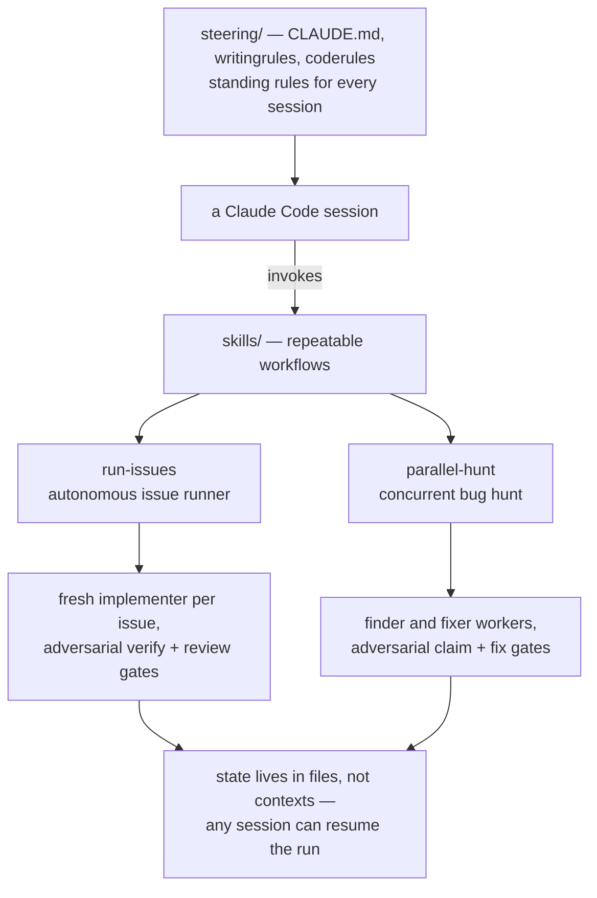

# agent-skills

Skills, steering rules and multi-agent workflows I use with Claude Code, published
as I write them. The interesting part is orchestration: an autonomous issue runner
and a parallel bug hunt that spawn fresh subagents for every job, gate their output
adversarially, and resume themselves across rate limits. Everything here runs my
real projects first; this repo is the record.

## How the pieces fit

Three layers. Steering documents set standing rules for every session. Skills
encode workflows a session can invoke. The orchestration skills go further: they
turn one session into a thin runner that spawns workers and gates as disposable
subagents, with all state in files so any later session can resume the run.

## The orchestration skills

### [run-issues](skills/run-issues/SKILL.md)

One thin runner session implements a range of tracker issues end to end,
unsupervised. The human is needed twice: a go-ahead before the final coherence
review, and the merge read at the end. The design choices that earn their keep:

- Every worker is a fresh subagent. An implementer gets one issue; verify and
  review gates get one verdict each, then die. Context never accumulates, and a
  codebase primer means exploration is paid once per run, not once per issue.
- Gates are adversarial and must cite driven evidence. A verify gate drives the
  running app and rejects with observed behaviour; a review gate tries to refute
  the diff. "It looks right" is not a verdict.
- Two strikes and the implementer is dismissed. A fresh implementer on a stronger
  model gets the issue and both rejection verdicts, but none of the failed
  reasoning, and is told not to trust the previous diagnosis.
- The ledger is thin because every spawn reads it; the narrative lives in a
  journal only a resuming runner and the finale read. Shared external quotas
  (API caps, send limits) are run state owned by the runner, and one agent holds
  the spend window at a time.
- A cron wakes the run after usage-limit resets. Nothing merges without a human.

### [parallel-hunt](skills/parallel-hunt/SKILL.md)

A concurrent bug-hunt round: finder and fixer workers run as background subagents
over a shared file register, with claim gates killing phantom bugs before they
enter the pipeline and fix gates refusing fixes that mask symptoms. Strict code
ownership keeps the merge tax at zero: the finder may only add new regression
tests, the fixer owns shipped code, and nobody waits on anybody. Workers are
replaced after one work unit because long sessions degrade quietly; the register
is the handoff, so succession needs no ceremony.

## The other skills

### [designrules](skills/designrules/SKILL.md)

Taste, made loadable. A distilled set of design rules (hierarchy, spacing,
typography, colour, states, the premium-feel psychology) that agents must read
before any visual work. It exists because "make it look good" is not an
instruction; a checklist an agent can be held to is.

### [memory-reel](skills/memory-reel/SKILL.md)

A different genre: turns a folder of mixed photos and videos into an edited,
music-driven film, unattended. Inventory and contact sheets before any questions,
a plan the user approves before any build, and chunked resumable scripts because
sandbox shells die mid-render. First version; actively improving.

## Steering

[steering/](steering/) holds the standing rules every session loads: a lean
global [CLAUDE.md](steering/CLAUDE.md) (context hygiene, when skills are
mandatory, how to brief me on manual steps),
[writingrules.md](steering/writingrules.md) (how to write like a person, distilled
partly from Wikipedia's "Signs of AI writing" catalogue) and
[coderules.md](steering/coderules.md) (security non-negotiables grounded in the
OWASP Top 10 and the Supabase production checklist, plus a pre-launch gate that
runs every time). These are the difference between an agent that works for me and
an agent that works.

## Case study

[Five issues, one unsupervised day](docs/case-study-five-issue-run.md) — a real
run of `run-issues` on a multi-tenant SaaS build: 139 tests added, zero
regressions, two adversarial rejections that were both genuine money defects, a
two-strike escalation that beat symptom-patching with a type-level redesign, and
the post-run review that fed eight revisions back into the skill you see here.

## Using these yourself

Copy any skill folder into `~/.claude/skills/` and it becomes invocable in Claude
Code. The orchestration skills assume an issue-tracker convention (see credits)
and a repo with tests worth gating on; the steering docs are mine — take the
structure, replace the taste.

## Credits

My daily process skills (`tdd`, `grilling`, `to-issues`, `handoff`, `triage` and
friends) are [Matt Pocock's skills](https://github.com/mattpocock/skills), used
unmodified and referenced here rather than republished. `run-issues` builds
on the issue-tracker conventions his pack establishes.

## Licence

[MIT](LICENSE). Take what's useful.
