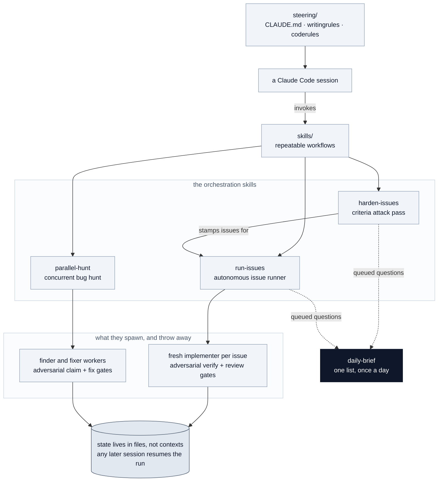
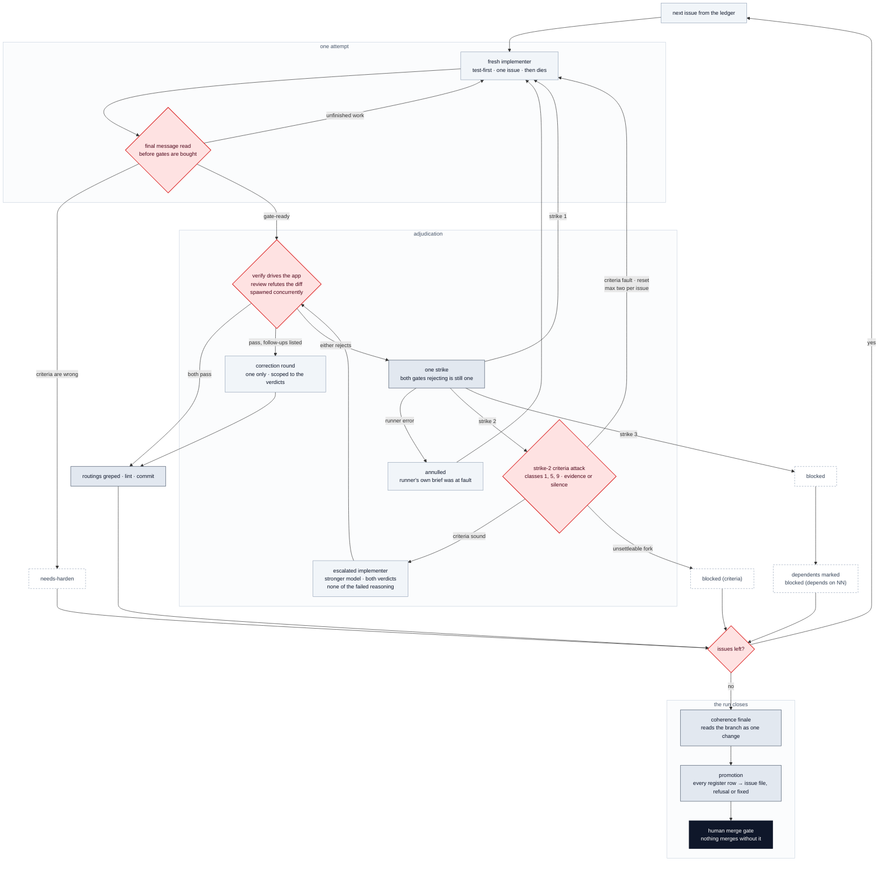
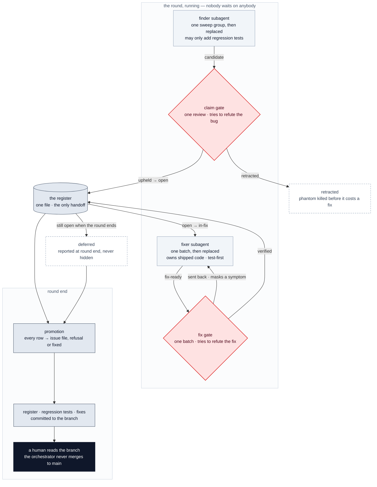

# agent-skills

Skills, steering rules and multi-agent workflows I use with Claude Code, published
as I write them. The interesting part is orchestration: an autonomous issue runner
and a parallel bug hunt that spawn fresh subagents for every job, gate their output
adversarially, and resume themselves across rate limits. Everything here runs my
real projects first; this repo is the record.

## The setting nothing read

From the first version of these skills until the week I checked, they carried a
table assigning a thinking-effort level to every role. Nothing in the harness ever
read it — the `Agent` tool takes a model but has no effort parameter, so every
worker had been inheriting one session-wide setting the entire time. [How the models and effort levels were actually
chosen](docs/model-and-effort-choices.md) is the record of finding that, measuring
the replacement instead of guessing at it, and reporting the result where it
contradicted the documentation.

## How the pieces fit

Three layers. Steering documents set standing rules for every session. Skills
encode workflows a session can invoke. The orchestration skills go further: they
turn one session into a thin runner that spawns workers and gates as disposable
subagents, with all state in files so any later session can resume the run.

```mermaid
%%{init: {"flowchart": {"curve": "basis"}, "themeVariables": {"fontSize": "14px"}}}%%
flowchart TD
    ST["steering/<br/>CLAUDE.md · writingrules · coderules"]
    SES["a Claude Code session"]
    SK["skills/<br/>repeatable workflows"]

    subgraph ORCH ["the orchestration skills"]
        HI["harden-issues<br/>criteria attack pass"]
        RI["run-issues<br/>autonomous issue runner"]
        PH["parallel-hunt<br/>concurrent bug hunt"]
    end

    subgraph SPAWN ["what they spawn, and throw away"]
        W1["fresh implementer per issue<br/>adversarial verify + review gates"]
        W2["finder and fixer workers<br/>adversarial claim + fix gates"]
    end

    F[("state lives in files, not contexts<br/>any later session resumes the run")]
    DB["daily-brief<br/>one list, once a day"]

    ST --> SES
    SES -->|invokes| SK
    SK --> HI
    SK --> RI
    SK --> PH
    HI -->|stamps issues for| RI
    RI --> W1
    PH --> W2
    W1 --> F
    W2 --> F
    HI -.->|queued questions| DB
    RI -.->|queued questions| DB

    classDef step fill:#F1F5F9,stroke:#94A3B8,stroke-width:1px,color:#0F172A
    classDef keep fill:#E2E8F0,stroke:#475569,stroke-width:1px,color:#0F172A
    classDef human fill:#0F172A,stroke:#0F172A,stroke-width:1px,color:#FFFFFF
    class ST,SES,SK,HI,RI,PH,W1,W2 step
    class F keep
    class DB human
    style ORCH fill:#FBFCFD,stroke:#CBD5E1,color:#475569
    style SPAWN fill:#FBFCFD,stroke:#CBD5E1,color:#475569
```

## The orchestration skills

### [run-issues](skills/run-issues/SKILL.md)

One thin runner session implements a range of tracker issues end to end,
unsupervised. The human is needed once: the merge read at the end.

```mermaid
%%{init: {"flowchart": {"curve": "basis"}, "themeVariables": {"fontSize": "14px"}}}%%
flowchart TD
    N["next issue from the ledger"]

    subgraph ATT ["one attempt"]
        IMP["fresh implementer<br/>test-first · one issue · then dies"]
        FM{"final message read<br/>before gates are bought"}
    end

    subgraph ADJ ["adjudication"]
        G{"verify drives the app<br/>review refutes the diff<br/>spawned concurrently"}
        CORR["correction round<br/>one only · scoped to the verdicts"]
        STR["one strike<br/>both gates rejecting is still one"]
        ANN["annulled<br/>runner's own brief was at fault"]
        RC{"strike-2 criteria attack<br/>classes 1, 5, 9 · evidence or silence"}
        ESC["escalated implementer<br/>stronger model · both verdicts<br/>none of the failed reasoning"]
    end

    RT["routings greped · lint · commit"]
    NH["needs-harden"]
    B["blocked"]
    BC["blocked (criteria)"]
    DEP["dependents marked<br/>blocked (depends on NN)"]
    MORE{"issues left?"}

    subgraph CLOSE ["the run closes"]
        FIN["coherence finale<br/>reads the branch as one change"]
        PROM["promotion<br/>every register row → issue file, refusal or fixed"]
        H["human merge gate<br/>nothing merges without it"]
    end

    N --> IMP
    IMP --> FM
    FM -->|"unfinished work"| IMP
    FM -->|"criteria are wrong"| NH
    FM -->|"gate-ready"| G

    G -->|"both pass"| RT
    G -->|"pass, follow-ups listed"| CORR
    CORR --> RT
    G -->|"either rejects"| STR

    STR -->|"runner error"| ANN
    ANN --> IMP
    STR -->|"strike 1"| IMP
    STR -->|"strike 2"| RC
    STR -->|"strike 3"| B

    RC -->|"criteria fault · reset<br/>max two per issue"| IMP
    RC -->|"criteria sound"| ESC
    RC -->|"unsettleable fork"| BC
    ESC --> G

    B --> DEP
    RT --> MORE
    DEP --> MORE
    BC --> MORE
    NH --> MORE
    MORE -->|yes| N
    MORE -->|no| FIN
    FIN --> PROM
    PROM --> H

    classDef step fill:#F1F5F9,stroke:#94A3B8,stroke-width:1px,color:#0F172A
    classDef keep fill:#E2E8F0,stroke:#475569,stroke-width:1px,color:#0F172A
    classDef gate fill:#FEE2E2,stroke:#DC2626,stroke-width:1.5px,color:#4C0519
    classDef stop fill:#FFFFFF,stroke:#94A3B8,stroke-width:1px,stroke-dasharray:4 3,color:#334155
    classDef human fill:#0F172A,stroke:#0F172A,stroke-width:1px,color:#FFFFFF
    class N,IMP,ESC,CORR,ANN step
    class FM,G,RC,MORE gate
    class RT,STR,FIN,PROM keep
    class NH,B,BC,DEP stop
    class H human
    style ATT fill:#FBFCFD,stroke:#CBD5E1,color:#475569
    style ADJ fill:#FBFCFD,stroke:#CBD5E1,color:#475569
    style CLOSE fill:#FBFCFD,stroke:#CBD5E1,color:#475569
```

The design choices that earn their keep:

- Every worker is a fresh subagent. An implementer gets one issue; verify and
  review gates get one verdict each, then die. Context never accumulates, and a
  codebase primer means exploration is paid once per run, not once per issue.
- Gates are adversarial and must cite driven evidence. Both spawn in one message
  and neither reads the other's verdict: verify drives the running app and rejects
  with observed behaviour, review tries to refute the diff. "It looks right" is
  not a verdict.
- Two strikes buy a criteria re-check, not a third implementer. An attacker
  re-reads the issue against both verdicts. If the criteria were wrong, the
  attempts are annulled and a fresh implementer builds to the corrected issue. If
  they were sound, an escalated implementer on a stronger model gets both verdicts
  but none of the failed reasoning, and is told not to trust the previous
  diagnosis.
- The ledger is thin because every spawn reads it; the narrative lives in a
  journal only a resuming runner and the finale read. Shared external quotas
  (API caps, send limits) are run state owned by the runner, and one agent holds
  the spend window at a time.
- A halt writes its own resume state into the ledger — what is on disk, what is
  owed, in what order — so a run picks up where it stopped whether a session cron
  revives it or a human does. Nothing merges without a human.

### [harden-issues](skills/harden-issues/SKILL.md)

The fix for the failure mode gates cannot catch: an issue whose acceptance
criteria were wrong when written passes every gate, because every gate grades
against the issue. This pass attacks criteria at authoring time — one attacker
subagent per issue plus a seam agent over the whole set, working a checklist of
nine blind-spot classes that each shipped a real defect through green gates
(unstated invariants, vague words, guards that cannot fail, unverified premises,
empty test data, deploy ordering, unobservable criteria, oversized slices, plus
a seam pass for what falls between issues). It may only write what it can cite
evidence for; every open fork routes to the human. Hardened issues carry a dated
stamp that `run-issues` checks at launch.

### [daily-brief](skills/daily-brief/SKILL.md)

The human loop, made single. Nothing in the chain stops mid-run to ask a
question — every skill takes its recommended default, records it as a default
rather than a decision, and queues it. This skill collates those queues, plus
unmerged branches and anything else resting on a human, into one brief read once
a day, then writes the answers back. Merge approvals carry the branch SHA they
were read against: a branch that moved since is re-presented, never merged — a
stale approval is not an approval.

### [parallel-hunt](skills/parallel-hunt/SKILL.md)

A concurrent bug-hunt round: finder and fixer workers run as background subagents
over a shared file register, with claim gates killing phantom bugs before they
enter the pipeline and fix gates refusing fixes that mask symptoms.

```mermaid
%%{init: {"flowchart": {"curve": "basis"}, "themeVariables": {"fontSize": "14px"}}}%%
flowchart TD
    REG[("the register<br/>one file · the only handoff")]

    subgraph RUN ["the round, running — nobody waits on anybody"]
        FIND["finder subagent<br/>one sweep group, then replaced<br/>may only add regression tests"]
        CG{"claim gate<br/>one review · tries to refute the bug"}
        FIX["fixer subagent<br/>one batch, then replaced<br/>owns shipped code · test-first"]
        FG{"fix gate<br/>one batch · tries to refute the fix"}
    end

    DEAD["retracted<br/>phantom killed before it costs a fix"]
    DEFER["deferred<br/>reported at round end, never hidden"]

    subgraph ENDR ["round end"]
        PROM["promotion<br/>every row → issue file, refusal or fixed"]
        COMMIT["register · regression tests · fixes<br/>committed to the branch"]
        HUM["a human reads the branch<br/>the orchestrator never merges to main"]
    end

    FIND -->|"candidate"| CG
    CG -->|"retracted"| DEAD
    CG -->|"upheld → open"| REG
    REG -->|"open → in-fix"| FIX
    FIX -->|"fix-ready"| FG
    FG -->|"sent back · masks a symptom"| FIX
    FG -->|"verified"| REG
    REG -->|"still open when the round ends"| DEFER
    REG --> PROM
    DEFER --> PROM
    PROM --> COMMIT
    COMMIT --> HUM

    classDef step fill:#F1F5F9,stroke:#94A3B8,stroke-width:1px,color:#0F172A
    classDef keep fill:#E2E8F0,stroke:#475569,stroke-width:1px,color:#0F172A
    classDef gate fill:#FEE2E2,stroke:#DC2626,stroke-width:1.5px,color:#4C0519
    classDef stop fill:#FFFFFF,stroke:#94A3B8,stroke-width:1px,stroke-dasharray:4 3,color:#334155
    classDef human fill:#0F172A,stroke:#0F172A,stroke-width:1px,color:#FFFFFF
    class FIND,FIX step
    class CG,FG gate
    class REG,COMMIT,PROM keep
    class DEAD,DEFER stop
    class HUM human
    style RUN fill:#FBFCFD,stroke:#CBD5E1,color:#475569
    style ENDR fill:#FBFCFD,stroke:#CBD5E1,color:#475569
```

Nobody waits on anybody: the finder is hunting the next bug while the fixer is
still on the last one. Strict code ownership is what keeps the merge tax at zero
while they run concurrently — the finder may only add regression tests, the fixer
owns shipped code. Workers are replaced after each work unit because long sessions
degrade quietly, and because the register holds everything, succession needs no
handover.

## The other skills

### [designrules](skills/designrules/SKILL.md)

Taste, made loadable. A distilled set of design rules (hierarchy, spacing,
typography, colour, states, the premium-feel psychology) that agents must read
before any visual work. It exists because "make it look good" is not an
instruction; a checklist an agent can be held to is.

### [panel-review](skills/panel-review/SKILL.md)

The orchestration idea pointed at judgement — prose or a system design. One
reviewer has blind spots, so this spawns three to eight personas as parallel
subagents, each with its own lens and never another persona's output, then
synthesises on agreement and maps the disagreements, deciding each with a stated
reason. The mechanism is borrowed from Stanford's STORM (OVAL Lab, NAACL 2024),
whose panel researches topics; here the panel is *derived*: enumerate the distinct
ways the artefact can be wrong, name who pays for each, and one exposure buys one
seat. At `deep` the same list also yields a frozen scenario corpus and a set of
invariants, so every persona walks identical cases; personas left to derive their
own walk different inputs, and the map then reports imagination as conflict. Tiers
route on blast radius, not length, and the `deep` tier adds a refutation gate that
attacks the panel's own findings and retracts on uncertainty. Two rules keep it
honest: a claim without a citation is not a claim, and any lens satisfied by
*adding* material may only propose
material the artefact already supports.

## Steering

[steering/](steering/) holds the standing rules every session loads: a lean
global [CLAUDE.md](steering/CLAUDE.md) (context hygiene, when skills are
mandatory, how to brief me on manual steps),
[writingrules.md](steering/writingrules.md) (how to write like a person, distilled
partly from Wikipedia's "Signs of AI writing" catalogue) and
[coderules.md](steering/coderules.md) (security non-negotiables grounded in the
OWASP Top 10 and the Supabase production checklist, plus a pre-launch gate that
runs every time), and [designrules.md](steering/designrules.md), which loads on
demand through the skill below rather than sitting in every session's context.
These are the difference between an agent that works for me and an agent that
works.

## The agent definitions

The orchestration skills don't paste briefs into their workers. Each role is a
registered agent type in [`agents/`](agents/), and the runner spawns it by name.
An agent file carries its own brief, model and effort level, and is loaded only
when that role actually runs — so the skill stays a thin protocol and the detail
lives with the role that needs it.

Sixteen roles: six for `run-issues` (implementer, escalated implementer, verify
gate, review gate, a critical review gate for diffs that change money or auth, and
the coherence finale), five for `parallel-hunt` (finder, fixer, claim gate, fix
gate, and a critical fix gate), two for `harden-issues` (the per-issue attacker
and the cross-issue seam agent), two for `panel-review` (one persona seat and
the refutation gate), and `promotion` — the one agent both loops share, the only
role that turns a register finding into an issue file.

This is also the only way to set effort per role — the `Agent` tool takes a model
but no effort parameter, so without these files every worker silently inherits one
session-wide setting.

## Case study

[Five issues, one unsupervised day](docs/case-study-five-issue-run.md) — a real
run of `run-issues` on a multi-tenant SaaS build: 139 tests added, zero
regressions, two adversarial rejections that were both genuine money defects, a
two-strike escalation that beat symptom-patching with a type-level redesign, and
the post-run review that fed eight revisions back into the skill you see here.

## Using these yourself

Copy any skill folder into `~/.claude/skills/` and it becomes invocable in Claude
Code. `panel-review` is the one exception to how skills get picked up: its
frontmatter carries `disable-model-invocation: true`, so you invoke it by name and
no model reaches for it on its own. The orchestration skills assume issues living
as files (this pack's convention: `.scratch/<feature>/issues/`, a `Status:` line
first) and a repo with tests worth gating on; the steering docs are mine — take
the structure, replace the taste.

**`run-issues`, `parallel-hunt`, `harden-issues` and `panel-review` also need the
agent definitions.** Copy `agents/` into `~/.claude/agents/` — the runner spawns
roles by name, so without them a run stops at the first spawn with "agent type not
found". Two things to know: newly
copied types can take a moment to appear, so restart Claude Code only if a spawn
still reports the type missing; and an invalid `effort:` value is accepted
silently and falls back to the default, so a typo costs you the setting with no
warning.

The files use `model: inherit`, meaning every worker runs whatever model the
session runs. Start the session on the model you want the run to use.

**Nothing here needs editing before it runs.** The skills and agent files depend
on each other and on nothing outside this repo — no personal memory files, no
named model, and no skill they cannot do without: `coderules`, `tdd` and
`code-review` are each used if your setup registers one and worked around if not.
Where a run wants something else a project may or
may not have (a preview deploy, a canonical env file, a skill that drives the
running app), it is written as a conditional and the run works either way. The
steering docs are the exception, and deliberately so: they are my taste, published
to be replaced rather than adopted.

## Credits

My daily process skills (`tdd`, `grilling`, `to-issues`, `handoff`, `triage` and
friends) are [Matt Pocock's skills](https://github.com/mattpocock/skills),
referenced here rather than republished — used unmodified except `to-prd` and
`to-issues`, which my local copies point at issue files as the canonical record
and extend with a `harden-issues` step and a rubric-shaped criteria template.
`run-issues` builds on the issue conventions his pack establishes.

## Licence

[MIT](LICENSE). Take what's useful.
